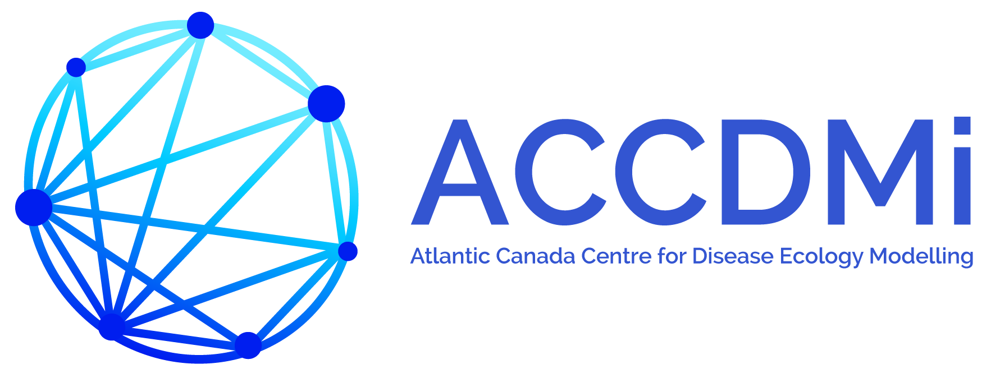
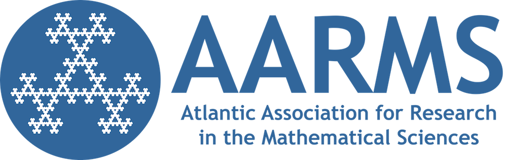

```{r, out.width="60%", echo=FALSE, purl=FALSE}

```

The Atlantic Canada Centre for Disease Ecology Modelling (ACCDMi, pronounced "academy") is a multidisciplinary research initiative to advance the science and application of infectious disease modelling to improve human and animal health.

ACCDMi will support the visibility of Atlantic Canada’s expertise in infectious disease modelling so that stakeholders, public health professionals, and experts in adjacent disciplines can discover the substantial expertise of mathematicians and statisticians and engage our experts in applied problems.

ACCDMi programs will build relationships and capacity through training, outreach, and collaborative partnerships to improve analyses by incorporating efficient algorithms, modelling approaches, and the perspectives of applied mathematics and statistics.

# Logos
- Logos can be downloaded [here](https://ahurford.github.io/accdmi-website/logo.html).

# Funding
ACCDMi is a Collaborative Research Group funded by the [Atlantic Association for Research in the Mathematical Sciences](https://aarms.math.ca/).

```{r logo, out.width="50%", echo=FALSE, purl=FALSE}

```

